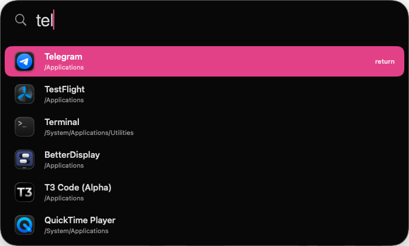

<p align="center">
  
</p>

<h1 align="center">Spotlite</h1>

<p align="center">
  A blazing-fast, bloat-free Spotlight replacement.<br>
  Opens your apps. Nothing else.
</p>

<p align="center">
  
</p>

---

## Why

macOS Spotlight is a kitchen sink — web results, files, calculator, dictionary, Siri suggestions. Most of the time you just want to launch an app.

Spotlite does that one thing. The whole release binary is **~200 KB** and built on the macOS 26 Liquid Glass APIs.

## Features

- **One job.** Fuzzy-search apps in `~/Applications`, `/Applications`, `/System/Applications`. Hit return. Done.
- **Liquid Glass UI.** Real `NSGlassEffectView`, not a faked blur.
- **Instant.** Pre-cached icons, recycled row views, zero re-layout on keystroke.
- **Animated expand.** Collapsed search bar grows down with a soft 420 ms ease as you type.
- **`⌘Space` global hotkey.** Works system-wide, registered via Carbon.
- **Menu-bar app.** No Dock icon, ~0% CPU when idle.

## Install

1. Download the latest [`Spotlite.zip`](Spotlite.zip)
2. Unzip and drag `Spotlite.app` into `/Applications`
3. **Right-click → Open** the first time (signed but not yet notarized)
4. If macOS refuses harder than that:
   ```sh
   xattr -dr com.apple.quarantine /Applications/Spotlite.app
   ```

## Use

| Action | Key |
| --- | --- |
| Toggle launcher | `⌘Space` |
| Move selection | `↑` `↓` or `Tab` `⇧Tab` |
| Launch | `Return` |
| Dismiss | `Esc` or click outside |

> **⌘Space conflict?** macOS Spotlight owns this shortcut by default. Disable it in *System Settings → Keyboard → Keyboard Shortcuts → Spotlight*, or edit `AppDelegate.swift` to pick another combo.

## Requirements

- macOS 26 Tahoe (uses `NSGlassEffectView`)
- Apple Silicon or Intel (universal binary)

## Build from source

```sh
git clone https://github.com/<you>/Spotlite.git
cd Spotlite
./build_app.sh
```

That builds a release binary, packages `Spotlite.app`, and launches it. Source is ~600 lines of Swift across 8 files.

## License

MIT
